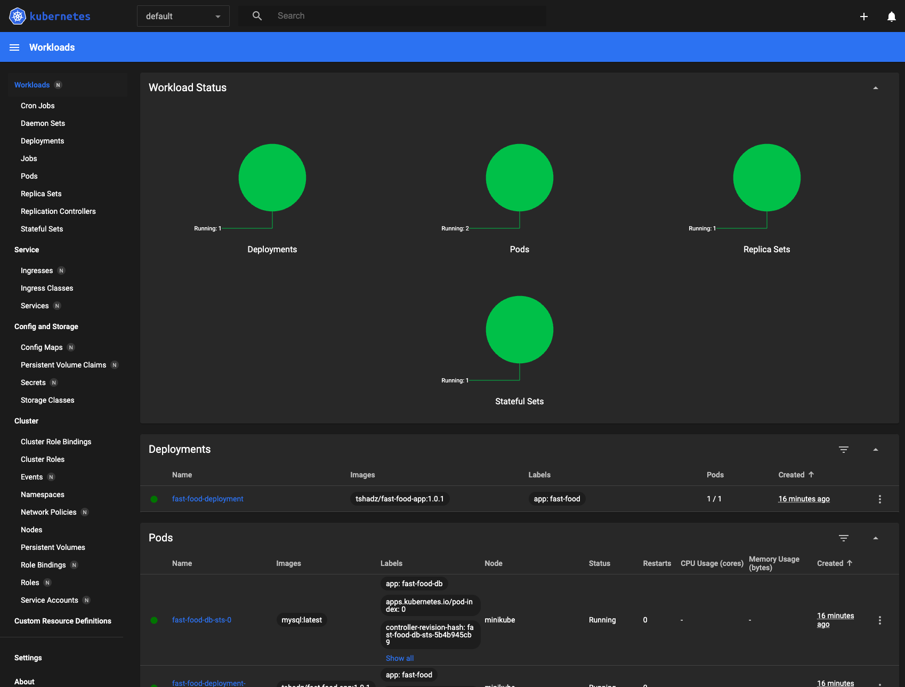

## Descrição
Gerenciamento de clusters com o minikube

## Instalação 

Site oficial -> https://minikube.sigs.k8s.io/docs/start/

## Rodar minikube

 ```bash

# Acesse a pasta do projeto no terminal

# Iniciar o minikube
$ minikube start

# Deploy da aplicação
$ kubectl apply -f k8s/

# Rodar K9s em um namespace
$ minikube dashboard

```

## Minikube dashboard tela


